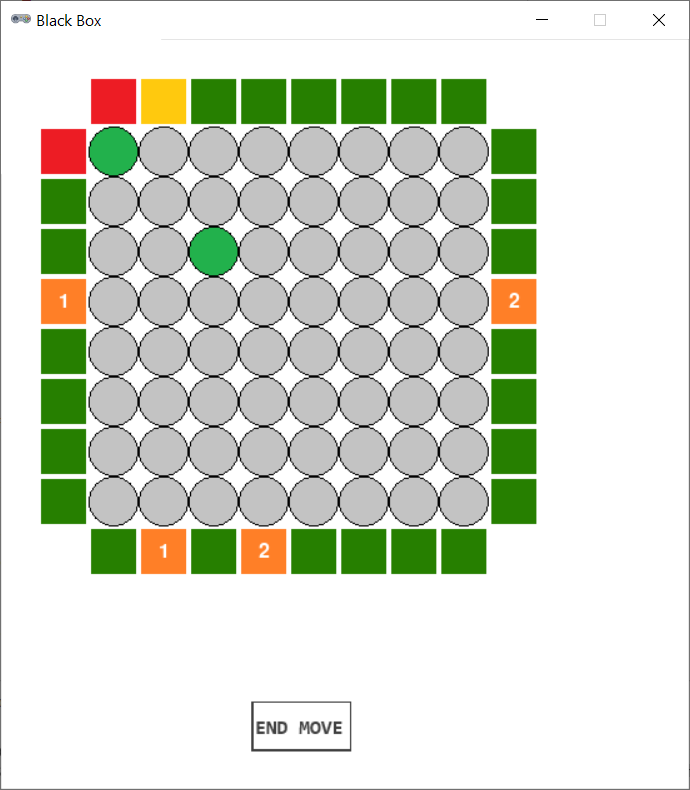
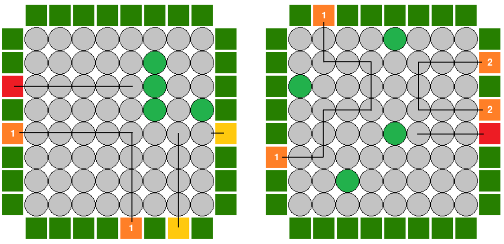

# Black Box



## Rules Summary

- The game is played on an 8 &times; 8 board with additional rows of 8 _laser beam cells_ adjacent to each side of the board. The board is assumed to contain four randomly placed hidden balls, and the task of the player is to deduce their locations.

- To obtain clues, the player can activate any laser beam cell to fire a laser into the board and analyze the outcome:
  
  - If the beam hits a hidden ball, the outcome is "hit". The cell is replaced with a red token.
  
  - If the beam reaches a cell sharing a corner with a hidden ball, the beam turns 90&deg; away from the ball and continues moving straight.

  - If the beam reaches the original laser beam cell, the outcome is "reflect". The cell is replaced with a yellow token. Note that when the laser reaches a cell sharing two corners with hidden balls, it has to turn 180&deg;. Also note that by convention "reflect" is reported when the activated laser beam cell is adjacent to a hidden ball on the edge of the board (so the beam cannot enter the board).

  - If the beam reaches any other laser beam cell, the outcome is "detour". Both cells are replaced with orange tokens marked with the same symbol (thus, orange tokens come in recognizable pairs).



- Once the player has identified the locations of all four balls, the game is over, and the final score is determined. In a two-player game, the second player decides hidden ball locations and provides clues.

- The final score is calculated as one point per each colored token on the board plus 5 points per each incorrectly guessed ball. The goal is to score as few points as possible.

## Running the Game

Console version:

```shell
poetry run python cli_blackbox.py
```

GUI version:

```shell
poetry run python gui_blackbox.py
```
