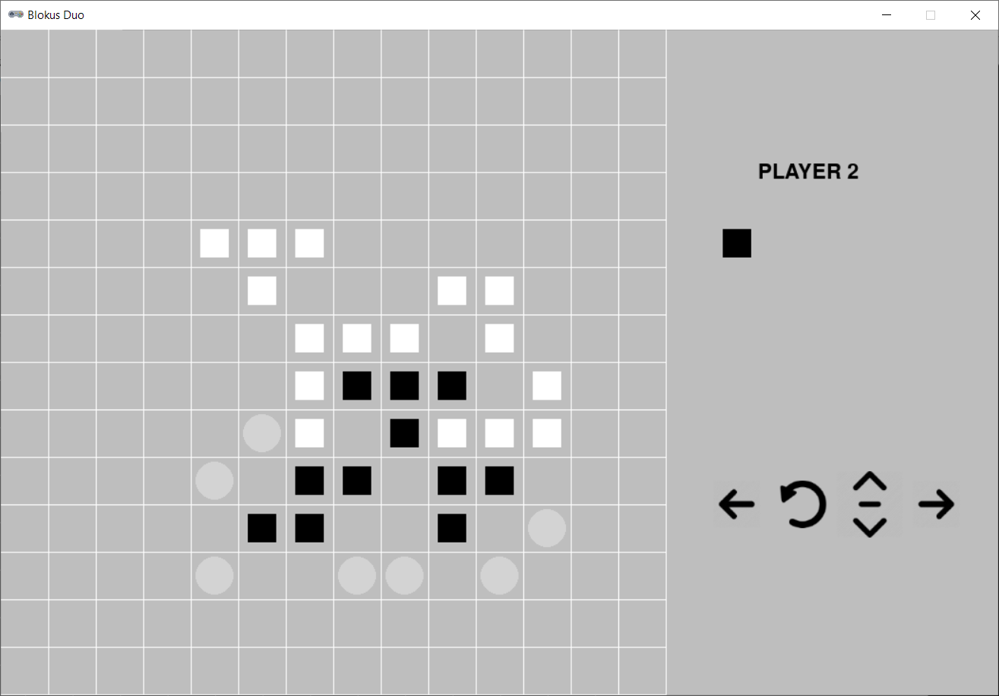

# Blokus duo



## Rules Summary

- Each player chooses a color and places that set of 21 pieces in front of his side of the board.
- Player 1 places one of her pieces on one of the two starting points.
- Player 2 places one of his pieces on the second starting point. 
- Play continues as each player lays down one piece during a turn. 
- Each new piece must touch at least one other piece of the same color, but only at the corners.
- No flat edges of same colored pieces can touch.
- There are no restrictions on how different colored pieces can touch one another.
- Once a game piece has been placed on the board it cannot be moved during subsequent turns.


## Running the Game

Console version:

```shell
poetry run python cli_blokusduo.py
```

GUI version:

```shell
poetry run python gui_blokusduo.py
```
