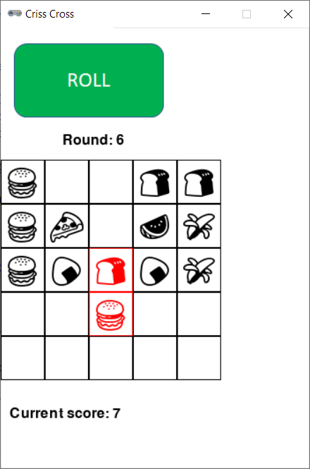

# Criss Cross



## Rules Summary

- Players compete independently to obtain the best score in their scorecards. The game can be also played solo: the score of 30+ points is considered top rank.

- Each player is given 5 &times; 5 scorecard with an upper left cell marked with a random die symbol (the game is played with two custom 6-face dice having various symbols instead of numbers). Players must start with different symbols.

- On each turn, two dice are rolled, and each player writes both die symbols into two adjacent cells of the scorecard either vertically or horizontally.

- The game continues while at least one player has space in the scorecard for the next pair.

- At the end of the game, the player's final score is calculated as a sum of scores of all vertical columns and horizontal rows in the scorecard. A column or row yields points for contiguous sequences of matching symbols as follows:

  - two symbols: 2 points;

  - three symbols: 3 points;

  - four symbols: 8 points;

  - five symbols: 10 points.

  For example, a row "11211" contains two "11" sequences, yielding 4 points, while a row "11121" yields 3 points for the sequence "111".

## Running the Game

Console version:

```shell
poetry run python cli_crisscross.py
```

GUI version:

```shell
poetry run python gui_crisscross.py
```
