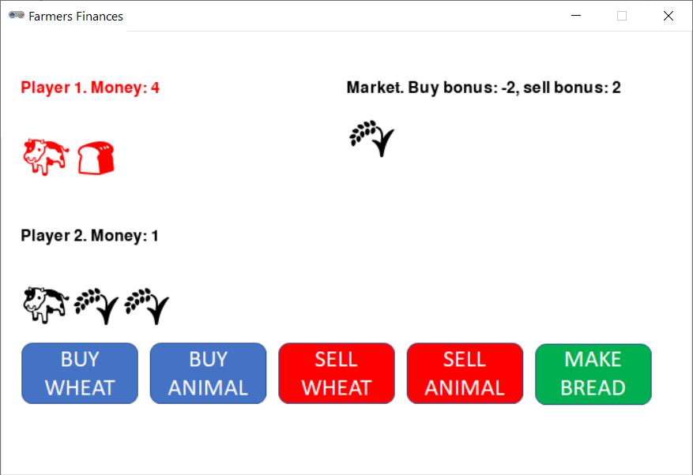

# Farmers Finances



## Rules Summary

- Each player starts with 10 coins and no products. The marketplace contains 4 "wheat" cards and 2 "animals" cards. The initial "buyer bonus" (_bb_) is set to a random integer in range -2...+2.

- On each turn a player can perform one of the following actions:
  - Buy one card from the marketplace. The prices are: wheat card = 2 - _bb_, animals card = 6 - _bb_. For example, if _bb_ = -1, the price of a wheat card is 3 coins. The price of any card is at least one coin regardless of bonuses.
  - Make bread. Turn any wheat cards at hand into bread cards.
  - Sell any cards of one type (wheat/animals/bread) back to the market. The prices are: wheat card = 5 - _bb_, animals card = 10 - _bb_, bread card = 7. Note that when the market is favorable to the buyers, it is not favorable to the sellers, and vice versa. Also note that bread is not affected by the bonus. When bread is sold, it turns back into wheat.

- _(Empty market rule.)_ If a player buys the last card from the market, both players must sell all their cards immediately.

- Before the turn is passed to the next player, the current player has to modify the market. The options are either to move buyer bonus one point up or down (within the allowed range; keeping the bonus unchanged is not allowed) or to _reroll_. When rerolling, use a six-sided die to determine the new buyer bonus (die faces 1 to 5). If six is rolled, a player chooses the bonus freely. If empty market rule was applied, the only option is to reroll.

- The turn is then passed to the other player. The game lasts until one of the players earns 70 coins or more. If the first player reaches this target first, the second player is given the last turn to catch up. In case of a tie, all player cards are sold without bonuses, and the final earnings are compared.

## Running the Game

Console version:

```shell
poetry run python cli_farmers.py
```

GUI version:

```shell
poetry run python gui_farmers.py
```
