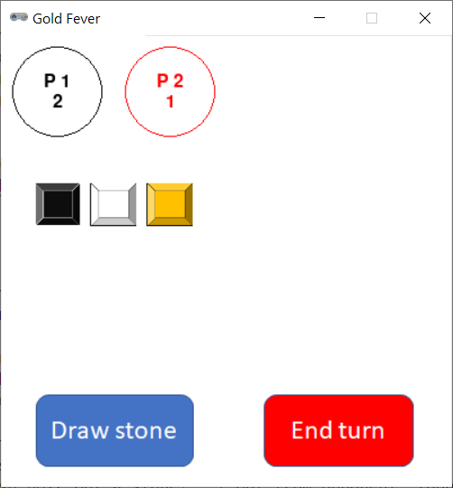

# Gold Fever



## Rules Summary

Note: this is a simplified "Panning for Gold" variation of rules. A two-player game session is presumed.

- Each player starts with 5 gold, 4 gray, 4 black, and 4 white stones in his bag.

- Players take turns until someone collects all five gold stones, becoming the winner.

- During a turn, a player first draws a random stone from his bag and puts it on the table.

- If the item drawn happens to be the second black, white, or gray stone on the table, the player's turn ends. The player returns all the stones from the table into his bag. In addition, in case of the second black stone, the opponent draws a random stone from his bag, and if it happens to be not gold, it is also added to the player's bag. (A gold stone is returned to the opponent's bag).

- In any other case the player has an option to continue drawing or to end the turn voluntarily. In the latter case, the player adds the amount of the gold stones on the table to his score and removes these stones from the game. The remaining non-gold stones are placed into the opponent's bag.

## Running the Game

Console version:

```shell
poetry run python cli_gfever.py
```

GUI version:

```shell
poetry run python gui_gfever.py
```
