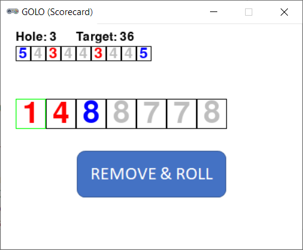

# GOLO (Scorecard Version)



## Rules Summary

- The player's challenge is to obtain the lowest "nine-hole score" in a golf course. A course consist of nine holes, and each hole is associated with a _par value_, representing an expected number of strokes required to complete it. Par values comprise a _scorecard_, such as [5 4 3 4 4 3 4 4 5] or [4 4 3 4 5 4 4 3 5].

- The game inventory consists of nine 12-sided dice with the following faces:

  - Red (par 3) die #1: 1, 3, 3, 3, 4, 4, 5, 5, 6, 6, 6, 8.

  - Red (par 3) die #2: 2, 3, 3, 3, 4, 4, 5, 5, 6, 6, 6, 7.

  - White (par 4) dice #1 to #5: 3, 4, 4, 4, 5, 5, 6, 6, 7, 7, 7, 8.

  - Blue (par 5) die #1: 3, 5, 5, 5, 6, 6, 7, 7, 8, 8, 8, 10.

  - Blue (par 5) die #2: 4, 5, 5, 5, 6, 6, 7, 7, 8, 8, 8, 9.

- The player also needs a course scorecard (real-life golf course cards can be used).

- First, a player rolls all nine dice and decides which holes to complete.

- The holes must be completed in order (from 1 to 9), and a die with the matching par number must be used. For example, only blue dice can be used to complete a par-5 hole.

- The player completes any number of holes (but at least one) by removing the corresponding amount of matching dice from the game.

- The remaining dice are rolled until all of them are removed.

- The sum of all removed dice is the final course score, which can be compared with the expected score according to the course scorecard.

## Running the Game

Console version:

```shell
poetry run python cli_goloscard.py
```

GUI version:

```shell
poetry run python gui_goloscard.py
```
