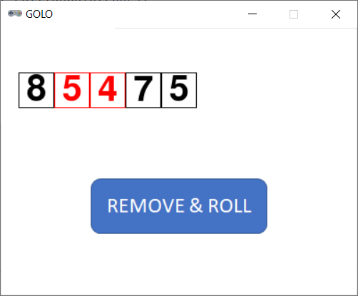

# GOLO



## Rules Summary

Note: this is the basic "Simple rules" version.

- The game inventory consists of nine 12-sided dice with the following faces:

  - Red die #1: 1, 3, 3, 3, 4, 4, 5, 5, 6, 6, 6, 8.

  - Red die #2: 2, 3, 3, 3, 4, 4, 5, 5, 6, 6, 6, 7.

  - White dice #1 to #5: 3, 4, 4, 4, 5, 5, 6, 6, 7, 7, 7, 8.

  - Blue die #1: 3, 5, 5, 5, 6, 6, 7, 7, 8, 8, 8, 10.

  - Blue die #2: 4, 5, 5, 5, 6, 6, 7, 7, 8, 8, 8, 9.

- The player's challenge is to obtain the lowest "nine-hole score" in a golf course.

- First, a player rolls all nine dice.

- Next, any number of dice (but at least one) with the lowest scores are removed from the game.

- While the "lowest-scores" condition is stated in the rules, it is not necessary to enforce it in practice: any reasonable strategy suggests removing the lowest-scoring dice anyway.

- The remaining dice are rolled until all of them are removed.

- The sum of all removed dice is the final score.

## Running the Game

Console version:

```shell
poetry run python cli_golo.py
```

GUI version:

```shell
poetry run python gui_golo.py
```
