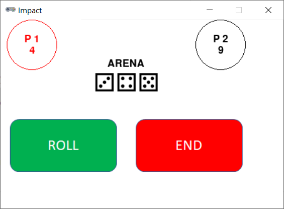

# Impact



## Rules Summary

- Each player is given 10 - _players_ dice (thus, 8 dice per player in a 2-player game), and one die showing any number except 1 is placed into the central "arena".

- Players take turns until only one of them (the winner) still possesses dice.

- During a turn, a player throws one die into the arena. It is presumed that it may knock and turn some of the dice present there.

- All dice showing "1" are permanently removed from the game. If any dice show the same number, they are added to the player's supply, and the turn ends.

- If all the numbers in the arena are distinct, the player can repeat a throw attempt or pass turn to the next player.

- If as a result of a turn the arena becomes empty, the next player will have to throw _all_ possessed dice at once.

## Running the Game

Console version:

```shell
poetry run python cli_impact.py
```

GUI version:

```shell
poetry run python gui_impact.py
```
