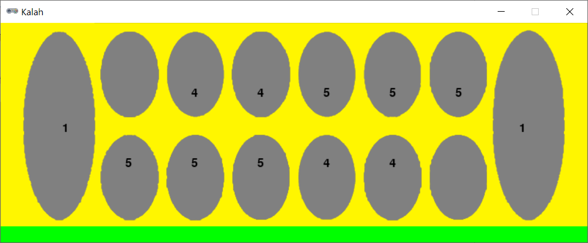

# Kalah



## Rules Summary

- The game board consists of 12 small pits called _houses_ and two large pits called _stores_. The houses at the lower side of the board and the right store belong to the bottom player. The houses at the upper side of the board and the left store belong to the top player. All houses initially contain the same amount of _stones_.

- During a turn, a player takes all the stones from any of his houses and places one stone in each of the subsequent pits, proceeding in a counter-clockwise direction. The opponent's store is skipped.

- If the last stone lands in the player's store, the player continues his turn. Otherwise, the turn is passed to the opponent.

- (Capture rule.) If the last stone lands in an empty house owned by the player, and the opposite house is not empty, all the stones in both houses are moved into the player's store.

- If a player cannot make a move, all the remaining seeds are placed into the opponent's store, and the game ends. The player with the largest number of stones in a store wins.

## Running the Game

Console version:

```shell
poetry run python cli_kalah.py
```

GUI version:

```shell
poetry run python gui_kalah.py
```
