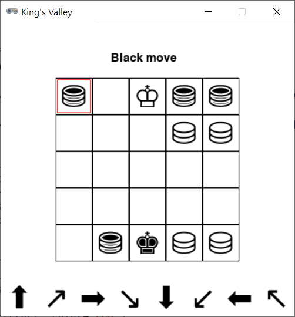

# King's Valley



## Rules Summary

- The game is played on a 5 &times; 5 board with five white and five black pieces. The initial setup is predefined: the top row is occupied with four black _pawns_ and a white _king_ in the middle, while the bottom row is taken by white pawns and a black king.

- On each turn, a player shifts any of his pieces in any of the eight compass directions _as far away as possible_, until another piece blocks the way or a board edge is reached.

- The player is declared winner if: a) his move ends with his king piece in the center of the board or b) he manages to "capture" the opponent's king so it cannot move anywhere on the next turn.

## Running the Game

Console version:

```shell
poetry run python cli_kvalley.py
```

GUI version:

```shell
poetry run python gui_kvalley.py
```
