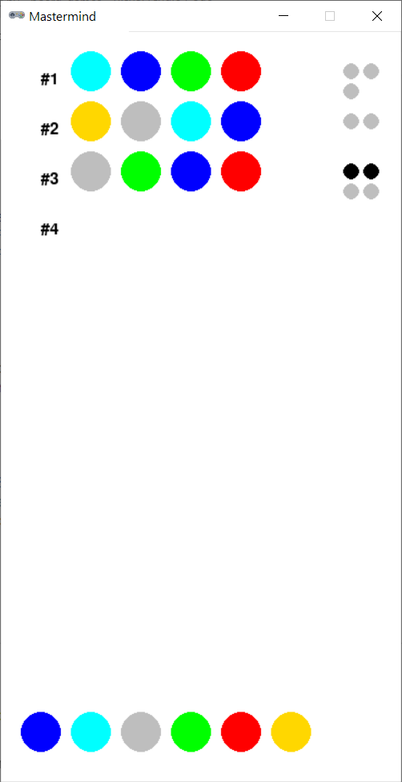

# Mastermind



## Rules Summary

- The task of the player is to deduce a code consisting of four colored pegs. In a two-player game version, one of the players chooses the code and provides hints.

- There are six distinct colors, and each color can appear in the code only once.

- The player makes an attempt to guess the code, and receives a feedback in form of 0-4 _key pegs_.

- A black key peg is set for every guessed colored peg placed in its correct position.

- A white key peg is set for every guessed colored peg placed incorrectly.

- For example, an attempt "BRGY" yields two black key pegs for the code "BGRY", since the elements "B" and "Y" are identified correctly. It also yields two white key pegs, corresponding to the elements "R" and "G".

- The game ends after the code is fully deduced or the player has exhausted twelve attempts.

This game is closely related to [Bulls and Cows](https://en.wikipedia.org/wiki/Bulls_and_Cows).

## Running the Game

Console version:

```shell
poetry run python cli_mastermind.py
```

GUI version:

```shell
poetry run python gui_mastermind.py
```
