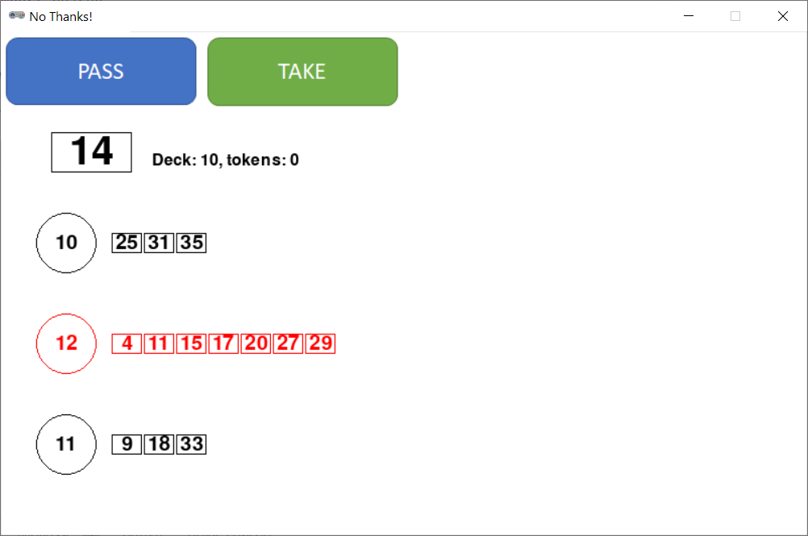

# No Thanks!



## Rules Summary

- In the beginning of the game, a deck of cards numbered 3 to 35 is shuffled, and nine random cards are removed. The deck is placed face up on the table, so the topmost card is always visible.

- Each player is given a certain amount of _pass tokens_ (11 for 3-5 players, 9 for 6 players, 7 for 7 players). The game can be played either under "open tokens" or "secret tokens" rules, when the amount of player's remaining tokens is not public.

- During a turn, a player:
  - either places a pass token on the topmost card of the deck and passes the turn to the next player;
  - or takes the topmost card from the deck with all accumulated tokens, and continues his turn.

- The game ends when there are no more cards left in the deck.

- Each player's final score is calculated as a sum of values of the smallest cards in _each contiguous card sequence_ minus the number of collected pass tokens. For example, a player with 3 pass tokens and cards [5, 7, 8, 9, 15, 16] scores 5 + 7 + 15 - 3 = 24 points.

- The player with the lowest score wins.

## Running the Game

Console version:

```shell
poetry run python cli_nothanks.py
```

GUI version:

```shell
poetry run python gui_nothanks.py
```
