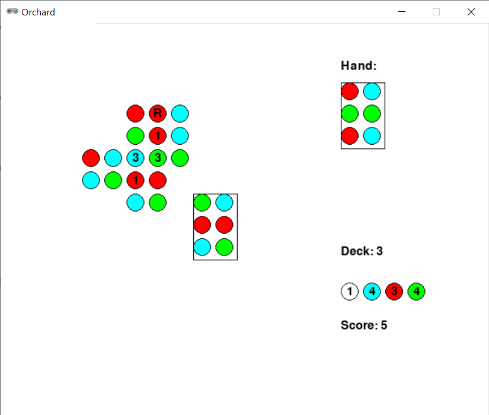
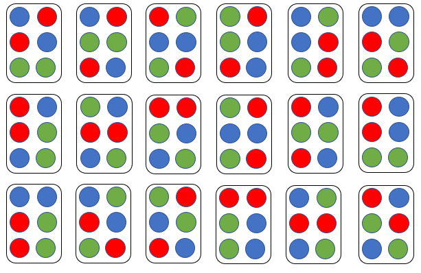

# Orchard



## Rules Summary

- Orchard is a single-player card solitaire game played with 9 randomly chosen cards from an 18-card custom deck:



- The aim is to score as many points as possible (55+ points is considered an _almost imposs-apple_ result).

- First, the player takes two cards as a hand and places the third card on the table.

- On each turn, the player places one of the cards at hand on the table and draws the next card if it is available. The game ends when all 9 cards are placed or no legal placement can be made.

  - A card can be placed either vertically or horizontally. At least one of its spots must overlap with at least one of the spots already on the table.

  - A spot on the card must match the spot it is going to overlap. It is possible to break this rule for two spots per game. In this case, a "rotten" token is placed on each mismatching spot, and subsequent cards cannot overlap them anymore.
  
  - When two matching spots overlap, the player places a matching scoring die on this area (if the die is available). The player has five scoring dice of each color (blue, red, green). If a "rotten" token is placed on a spot with a die, the die is returned to the player supply.

  - If another matching spot is about to be placed on top of a scoring die, the die is lifted up and rotated to show the next score. The scores on a die are 1, 3, 6, and 10 points.

- At the end of the game the total score is calculated as a sum of individual die scores. Each "rotten" token reduces the total score by 3 points.

## Running the Game

Console version:

```shell
poetry run python cli_orchard.py
```

GUI version:

```shell
poetry run python gui_orchard.py
```
