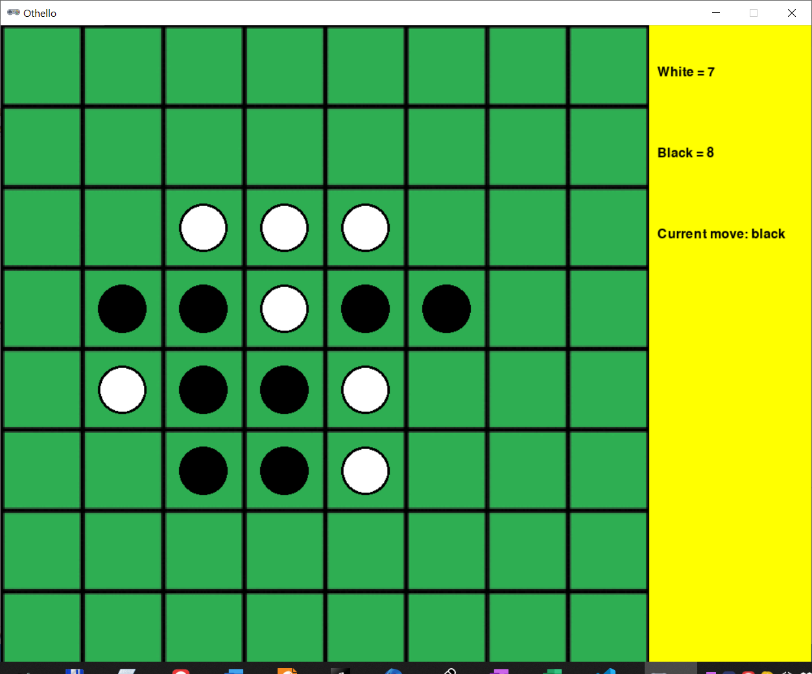

# Othello



## Rules Summary

- The game is played on a board with a fixed initial setup. Flat tokens with black and white sides are used to play, and each player is assigned one of these colors.

- During a turn, a player places one token (with player's color side up) to "capture" a vertical, horizontal, or diagonal line of opponent's tokens between a pair of player's tokens. Thus, a legal move forms a position where a newly placed token is separated from another token of the same visible color with a contiguous line of opponent's tokens.

- The board is examined in all eight directions from the newly placed token, and if any of them constitutes a "capture" made by a newly placed token, all "captured" opponent's tokens are flipped to another side. Then the turn is passed to the other player.

- If the player cannot make a legal move, the turn is passed to the other player.

- If both players cannot make a move anymore, the game ends, and the player with the largest number of tokens on the board wins.

## Running the Game

Console version:

```shell
poetry run python cli_othello.py
```

GUI version:

```shell
poetry run python gui_othello.py
```
