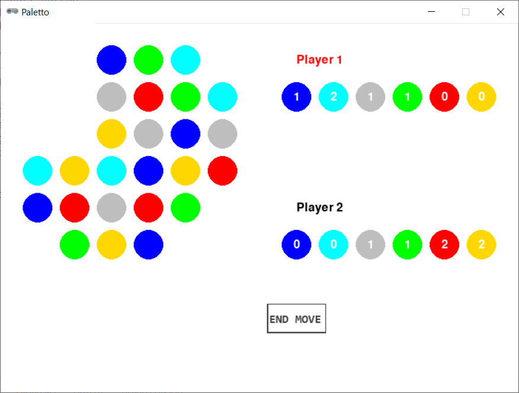

# Paletto



## Rules Summary

- The game is played on a 6 &times; 6 board. Initially, the board is occupied by 36 pieces (6 pieces per each of 6 available colors). The placement is random, but vertically or horizontally neighboring pieces must be of different colors.

- On each turn, a player can take any number of same-colored pieces if the following conditions are satisfied:
  - A piece can be taken only if it has no more than two neighbors.
  - A piece can be taken only if the remaining configuration is still connected, i.e. there are no isolated areas of pieces having no horizontal/vertical neighbors with other areas.

- The player who either collects all six pieces of any single color, or takes the last piece from the board, wins.

## Running the Game

Console version:

```shell
poetry run python cli_paletto.py
```

GUI version:

```shell
poetry run python gui_paletto.py
```
