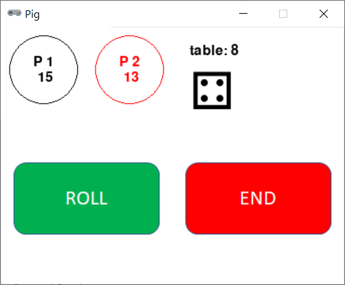

# Pig



## Rules Summary

- Players take turns until one of them scores 100 points.

- First, a player rolls a regular 6-sided die.

- If **one** is rolled, the turn ends. The player scores nothing in this turn and passes the die to another player.

- If any other number is rolled, the player adds this number to the current turn score and decides whether to continue rolling or to "hold".

- If the player decides to "hold", the total turn score is added to the player's final score, and the turn ends. The die is passed to another player.

The 3+ player variation of the game is called [Skunk](https://boardgamegeek.com/boardgame/3425/skunk).

## Running the Game

Console version:

```shell
poetry run python cli_pig.py
```

GUI version:

```shell
poetry run python gui_pig.py
```
