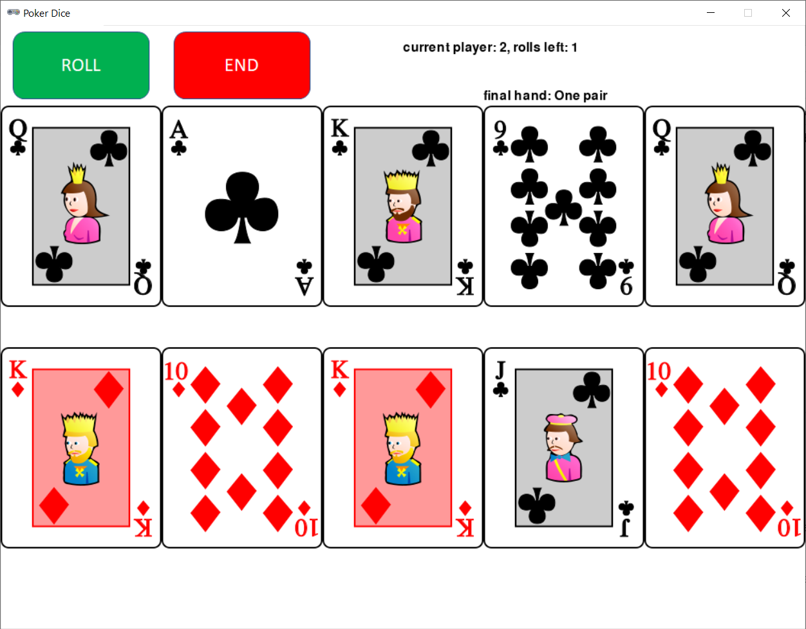

# Poker Dice



## Rules Summary

- The shortest game session consists of one turn per player (but usually more turns are played).

- During a turn, a player rolls five custom dice with sides representing six playing cards: 9, 10, Jack, Queen, King, and Ace.

- The player can end turn at this moment, or keep some dice at the table and re-roll the remaining dice.

- The same action (keep some dice, re-roll the others) can be performed once again before the turn is passed to the second player.

- When both players finished their turns, the player with a higher-ranked hand is declared winner. If no winning combination is collected, the player having a card of the highest value wins.

|Rank|Hand Name|Description|
|----|---------|-----------|
|#1|Five of a kind|All cards are the same|
|#2|Four of a kind|Four cards are the same|
|#3|Full house|Three same cards + two same cards|
|#4|Three of a kind|Three same cards|
|#5|Straight|Five consecutive cards|
|#6|Two pair|Two pairs of identical cards|
|#7|One pair|One pair of identical cards|


## Running the Game

Console version:

```shell
poetry run python cli_pokerdice.py
```

GUI version:

```shell
# note: click on a card to freeze it
poetry run python gui_pokerdice.py
```
