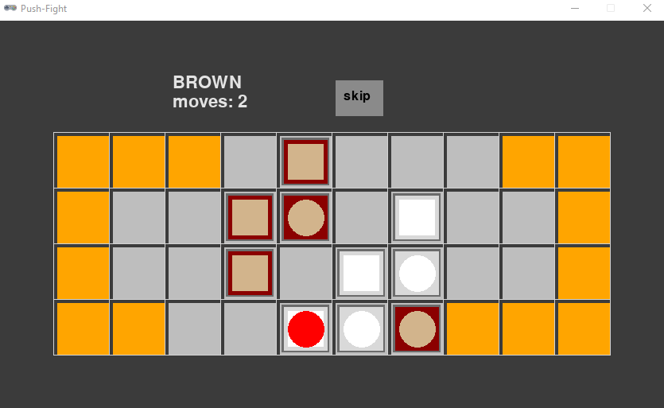
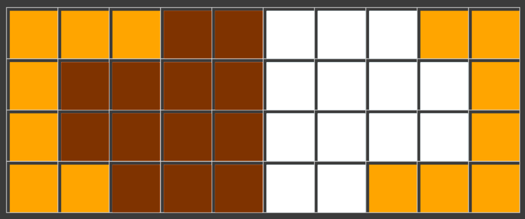

# Push Fight



## Rules Summary

- The game is played between the _White_ and the _Brown_ teams consisting of five pieces each. There are three cubic and two round-shaped pieces in each team.

- Both players start with positioning their pieces freely on their respective sides of the custom-shaped 2D board. The orange cells are not included into the board, and should be treated as forbidden "outside" or "lava" areas.



- During a turn, a player can make up to two optional _moves_ and one compulsory _push_:

  - A move involves relocating any piece from its position to any other board cell reachable via a "path" of adjacent empty cells. Cells are considered adjacent if they share the same edge.

  - A push involves moving a cubic piece to one of its adjacent cells while physically pushing any affected pieces of either color. Moving into an empty cell is not considered push.

  - After the push, the pushing piece is covered with an "anchor" token. Anchored pieces cannot be pushed (directly or indirectly). There is only one anchor in the game, and the opponent team will reuse it during its push action.

- The game is over when one of the players manages to push any of the opponent's pieces into one of the "lava" areas or makes it impossible to the opponent's team to complete its turn. This player is declared winner.

## Running the Game

Console version:

```shell
poetry run python cli_pushfight.py
```

GUI version:

```shell
poetry run python gui_pushfight.py
```
