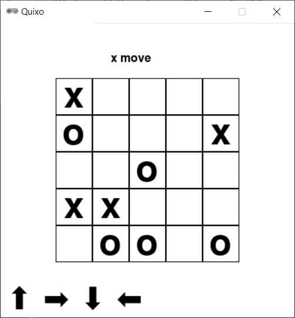

# Quixo



## Rules Summary

- The game is played on a 5 &times; 5 board fully covered with custom dice. Two faces of each die are marked with symbols "X" and "O", while all other faces are blank. Initially all dice are placed with blank faces up. Each player is assigned a character ("X" or "O").

- On each turn, a player takes a blank die or a die with the player's character face up from the board's outer border, turns it so it shows the player's character, and pushes the die from any side of the board to fill the gap. The die should not be placed back into the same cell where it was located originally.

- The objective of the player is to form a vertical, horizontal or diagonal line of five own characters to win.

## Running the Game

Console version:

```shell
poetry run python cli_quixo.py
```

GUI version:

```shell
poetry run python gui_quixo.py
```
