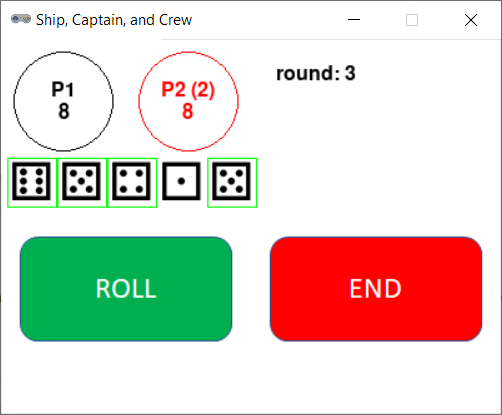

# Ship, Captain, and Crew



## Rules Summary

- Players take turns until one of the them scores 100 points or ten turns are completed by each player. In either case, the highest-scoring player is declared winner.

- During a turn, a player tries to procure a _ship_, a _captain_, a _crew_ and _cargo_ in this order by rolling five regular 6-sided dice. Up to three rolls can be made.

- First, a player rolls all five dice until a _ship_ (a die showing 6) is obtained.

- If a ship is rolled, the player sets its aside. A _captain_ (a die showing 5) is also set aside if it is present at the same roll. Otherwise, the next attempt is made.

- Likewise, a _crew_ (a die showing 4) is set aside at the same roll as a captain or at any later roll.

- The sum of the two remaining dice (_cargo_) constitutes the player's score for this turn. After crew is obtained, the player may try to reroll any cargo dice if unused attempts still remain.

## Running the Game

Console version:

```shell
poetry run python cli_scc.py
```

GUI version:

```shell
poetry run python gui_scc.py
```
