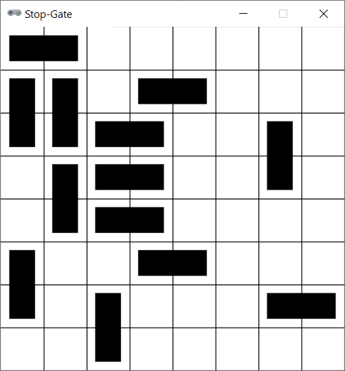

# Stop-Gate



## Rules Summary

- Players take turns placing two-square blocks (_dominoes_) until one of them is unable to continue and loses.

- The first player has to place _horizontal_ dominoes, the second player has to place _vertical_ dominoes.

- Placed dominoes cannot intersect.


## Running the Game

Console version:

```shell
poetry run python cli_stopgate.py
```

GUI version:

```shell
poetry run python gui_stopgate.py
```
